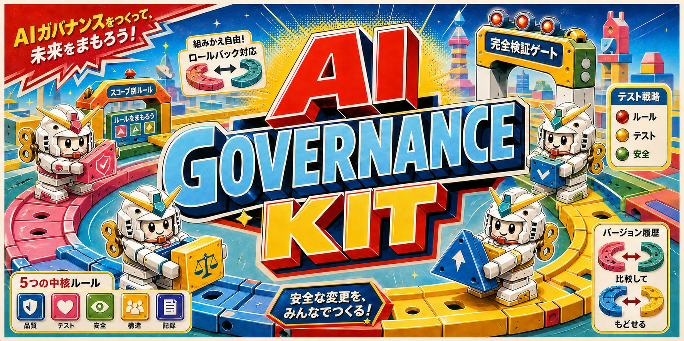

# AI Governance Kit



AI Governance Kit helps Codex and Claude understand how your project should be
changed. It gives them clear rules about how your project works, what must not
break, and how changes should be checked.

## Why use it?

Without clear guidance, an AI agent may misunderstand your project, follow the
wrong patterns, or say work is finished without checking it properly.

It may also keep adding code to the same file until that file grows beyond 2,000
lines. Files this large are difficult for people to understand and take the AI
longer to read and change. That can slow down future work and make mistakes more
likely.

AI Governance Kit encourages smaller, focused files and gives the agent one
reliable place to learn how your project should be handled.

## What will I get?

Your project will gain clear instructions that tell AI coding agents:

- which project documents to trust;
- what user behaviour must remain unchanged;
- how different parts of the project fit together;
- how changes should be written and checked;
- when your approval is required;
- how to report unfinished or uncertain work honestly.

You can also ask the agent to review and improve one folder or your whole
project.

## Before you start

Commands beginning with `ai-governance` go in your computer's terminal.
Commands beginning with `$ai-governance` go in your conversation with Codex.
For Claude Code, use `/ai-governance` instead.

Installation adds the kit to your computer. It does not change any of your
projects. The simple installer supports macOS and Linux.

## Install

Run this in your terminal:

```bash
# Download and install the newest tested version for Codex and Claude Code.
curl -fsSL https://github.com/SimonMo88/ai-governance-kit/releases/latest/download/install.sh | sh
```

The installer will tell you what it installed and what to do next. See the
[installation guide](docs/installation.md) for other options and Windows setup.

## Check the installation

```bash
# Show the installed version and whether Codex and Claude Code can find it.
ai-governance status

# Find installation problems without changing anything.
ai-governance doctor
```

## Keep it updated

```bash
# Install the newest tested version without changing your projects.
ai-governance update

# Return to the version you had before the last update.
ai-governance rollback
```

## Fix or remove it

Run `ai-governance doctor` first. It will explain the problem and give you the
right repair command.

```bash
# Repair the Codex installation after doctor reports a broken link.
ai-governance repair --target codex

# Show what will be removed and ask before uninstalling the kit.
ai-governance uninstall
```

## Use it in Codex or Claude

`status` and `doctor` only inspect the installation. `bootstrap`, `upgrade`, and
`refactor` can change project files. Review those changes before committing
them.

Add AI guidance to a project that does not have it yet:

```text
$ai-governance bootstrap
```

Improve the AI guidance already in a project:

```text
$ai-governance upgrade
```

Check whether the project's written rules are checked automatically:

```text
$ai-governance assess enforcement
```

Improve how code is organised in one folder without intentionally changing what
the product does:

```text
$ai-governance refactor folder src/payments
```

Review and improve project files owned by your team. Downloaded, generated, and
temporary files are excluded. This can take much longer than reviewing one
folder:

```text
$ai-governance refactor project
```

In Claude Code, replace `$ai-governance` with `/ai-governance` in these examples.

## Manage it from an AI conversation

You can also ask the skill to check or manage its installation:

- `$ai-governance status` — show the installed version and agent connections.
- `$ai-governance doctor` — find problems without changing anything.
- `$ai-governance update` — install the newest tested version.
- `$ai-governance rollback` — return to the version used before the update.
- `$ai-governance repair` — fix a problem found by `doctor`.
- `$ai-governance uninstall` — show what will be removed and ask first.

The agent will explain any change and follow its normal approval rules. If you
run `ai-governance refactor` in a terminal, it will give you the right AI prompt;
it will not change your project.

## More help

- [Installation and updates](docs/installation.md)
- [All terminal commands](docs/commands.md)
- [Ways to use the kit](docs/workflows.md)
- [Troubleshooting](docs/troubleshooting.md)
- [What gets added to a project](ADOPTION.md)
